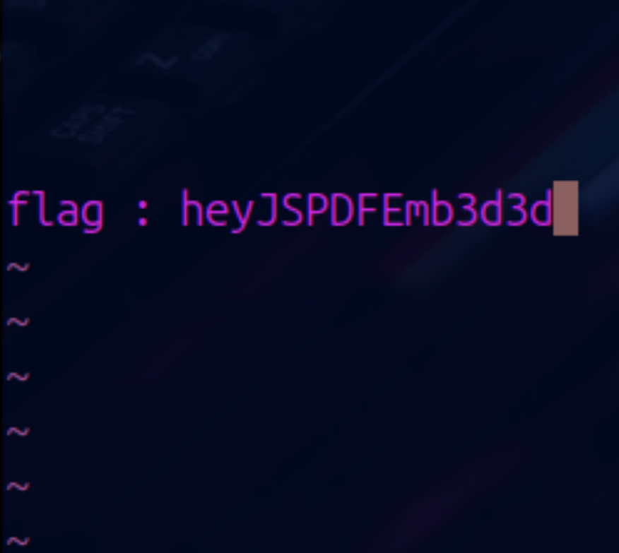

## task
```
Someone gave me a nice pair of PDF, can you 
figure out if there's some hidden data ?

The flag follows the format 4T${<hidden_data>},
 if the hidden data is hios, the flag should be 4T${hios}
```

I needed a tool to inspect the structure of PDF and I found qpdf

> qpdf --qdf --object-streams=disable Stirling.pdf output.pdf

```  
>>
  /AcroForm 4 0 R
  /Metadata 5 0 R
  /Names 7 0 R
  /OpenAction 8 0 R
  /PageMode /UseOutlines
  /Pages 9 0 R
  /Type /Catalog
>>
endobj

%% Original object ID: 20 0
2 0 obj
<<
  /Author ()
  /CreationDate (D:20230510175419Z)
  /Creator (LaTeX with hyperref)
  /Keywords ()
  /ModDate (D:20241102185901+01'00')
  /PTEX.Fullbanner (This is pdfTeX, Version 3.141592653-2.6-1.40.24 \(TeX Live 2022\) kpathsea version 6.3.4)
  /Producer (pdfTeX-1.40.24)
  /Subject ()
  /Title ()
  /Trapped /False
>>
endobj

%% Original object ID: 19 0
3 0 obj
<<
  /JS (app.alert\("mdp : Adm!nNDAop"\);)
  ```
  
I found something that looks like a password for NDA.pdf (Adm!nNDAop)
  
Then opened the NDA.pdf for flag

  
