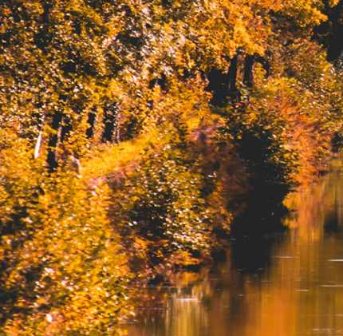

## task

```
Hello Agent,

Congratulations on your recent findings. We narrowly avoided an incident.
We managed to intercept a communication and obtained a date, time, and a photo of a meeting location.

Find the meeting location, and we will arrest any members found on site.

The flag is three word corresponding to the center of the bridge that we see.

The flag is in this format: 4T${word1.word2.word3}
```


- First I look closely at the picture and I saw a man
  

```
OSINT - Secret Meeting : The bridge is less than a 40-minute drive from Dijon.
```

I needed to find a bridge near `Dijon` in east
In the east is just one river so I needed to look near that area for a canal
because it was tight and straight

Near Saone was a canal named that was less than 40 min drive from the center of `Dijon`


And there it's a bridge so i look closely how it looks like


I found similarities and then i used `https://what3words.com/` to find words for the location


Flag `4T${arched.freckle.harnessed}`


