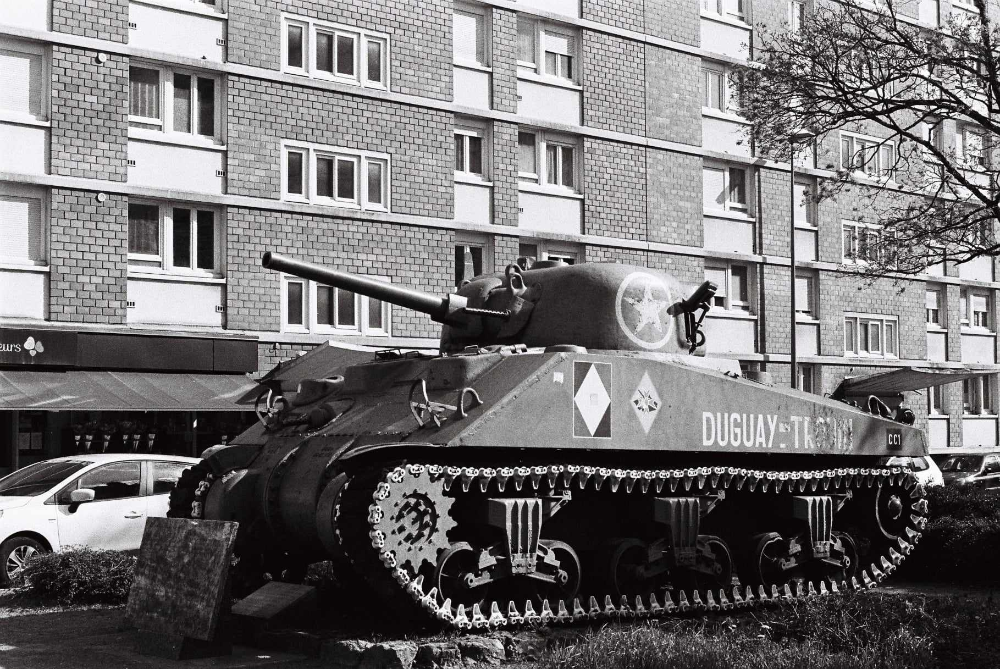
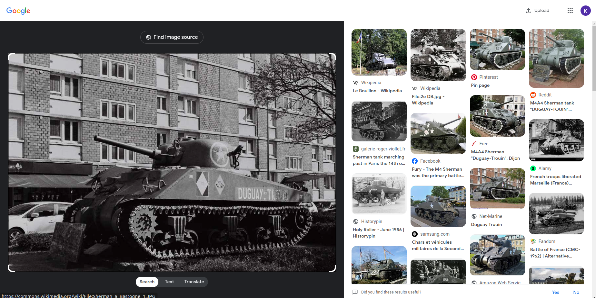
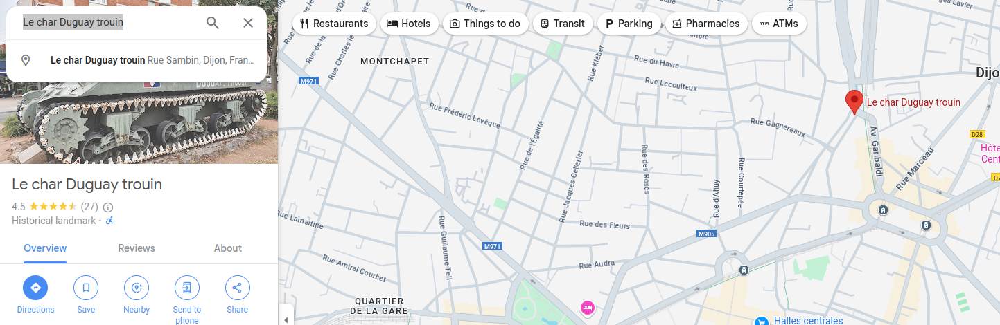
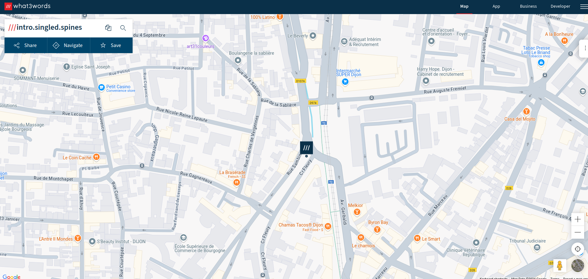
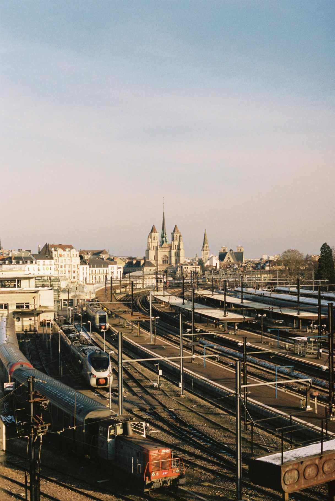
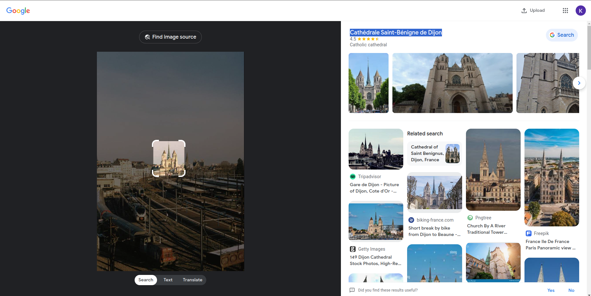
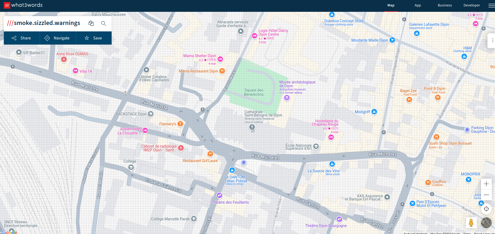
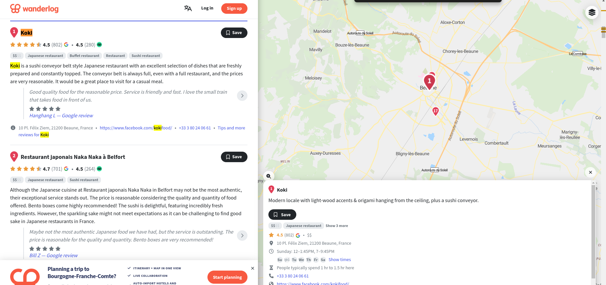
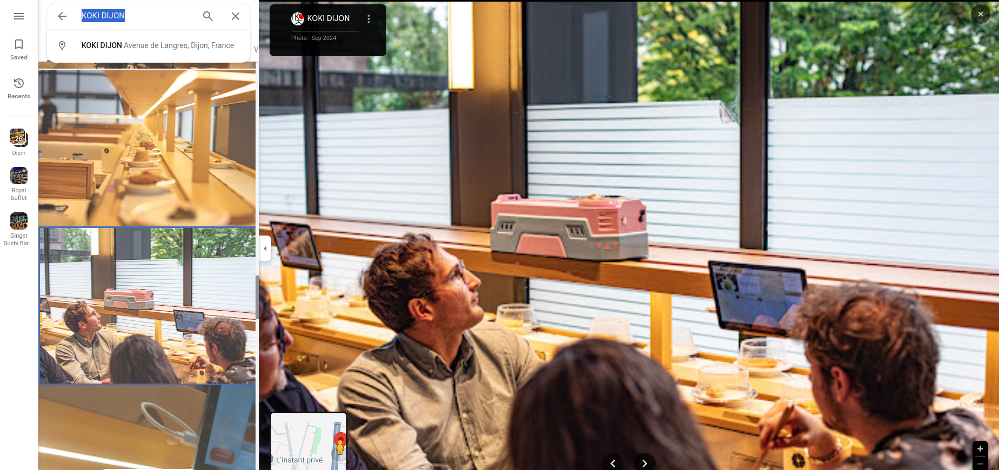
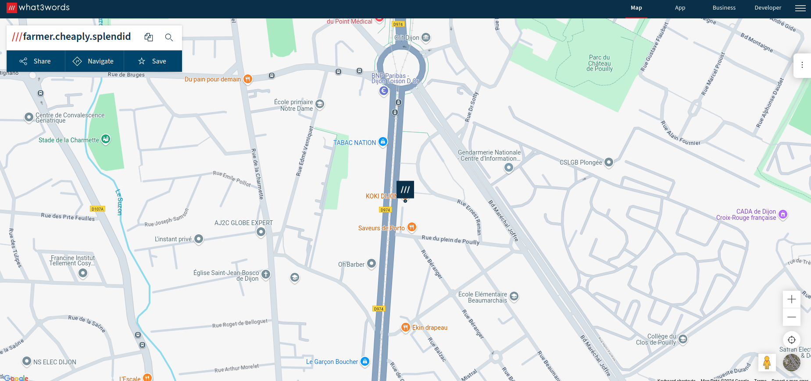

## Task

```
Hello Agent,

You are doing a great job. We have contacted the local authorities to gather information on our target.

We have since discovered that our target is part of an activist group called Hackcorp.
They are planning an attack on three locations.
For several years, our target has been gathering information on these locations.

Attached, you will find three photos of potential locations. You must identify the positions of these locations.

The location we ask you to find are:

First picture: It is pretty obviuous...

Second picture: The building on the center of background.

Third picture: The building where the photo was taken.

The flag is the concatenation of the first word of each three word.

The flag is in this format: 4T${word1.word2.word3}
```

the picture are

1. Target 1
   

- I searched it on `google lens` to got the name and location which is `Dijon`
  

- Then found the location on `google maps`
  

- then use the `https://what3words.com/` to find the first word for the location
  


2. Target 2
   

- I used the same tehnique
  
  

3. Target 3


- First I tried with `Google Lens` but no clue

- Then I looked more closely at the image and I saw a conveyor belt or rotating sushi bar setup

- I looked on `Google` for restaurants that has a sushi bar
  

- Then I saw the similarities
  

- Then I found the 3 words for it
  


The flag `4T${intro.smoke.fragment}`