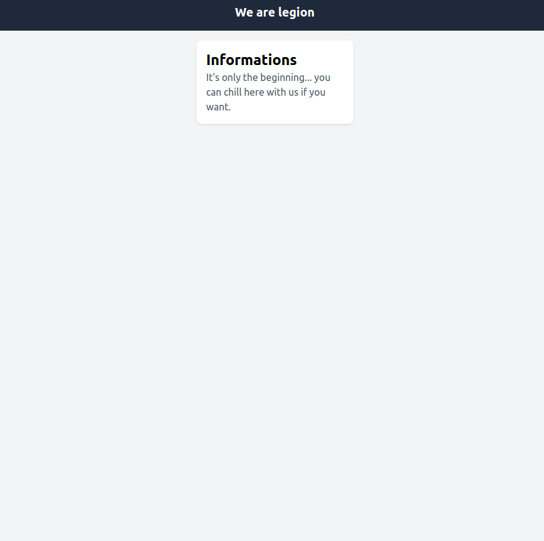
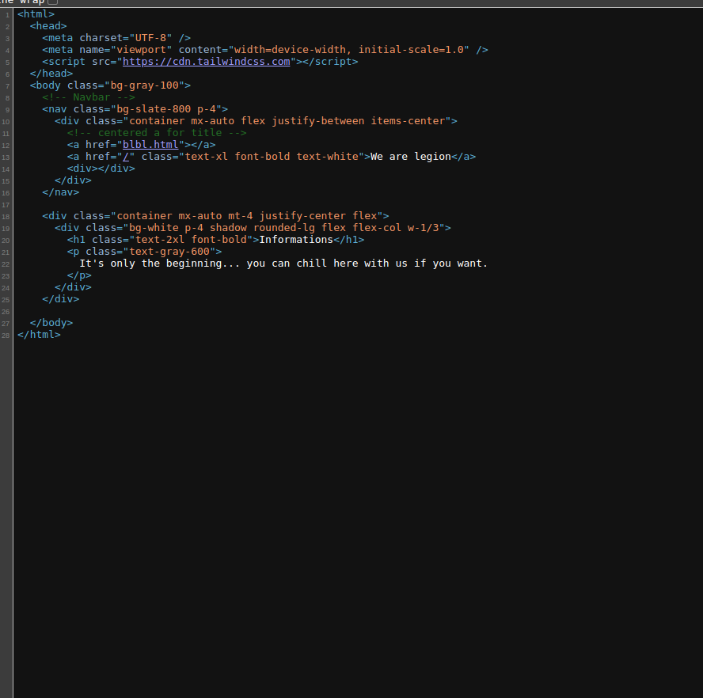
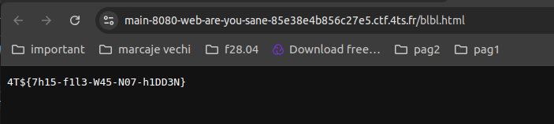

## Task

> This is a web sanity check, hopefully everyone is sane.

### Initial Landing Page Observation
I land on the page showed below where there are no visible 
buttons or links to proceed or interact with the page.

### Inspecting HTML Code
To investigate further,the HTML code of the page was inspected as showed below.

That was a link not visible in page that caught my attention 
so I clicked on it and found the flag

