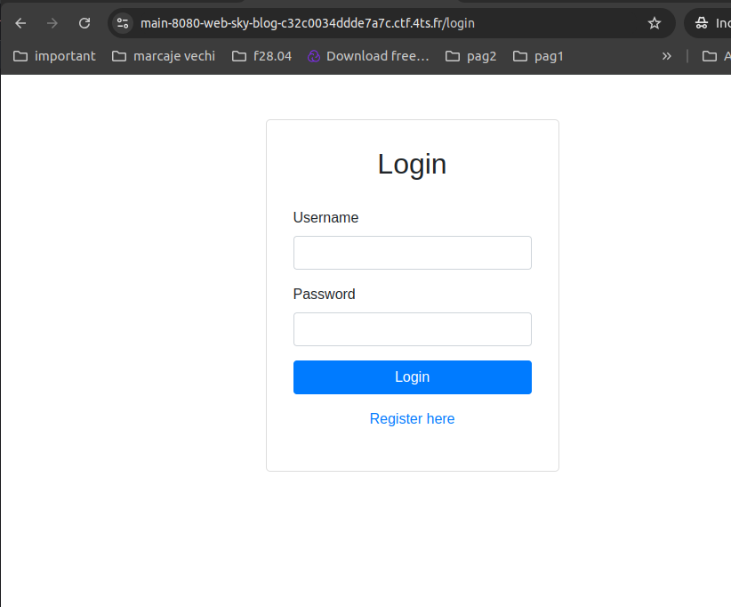
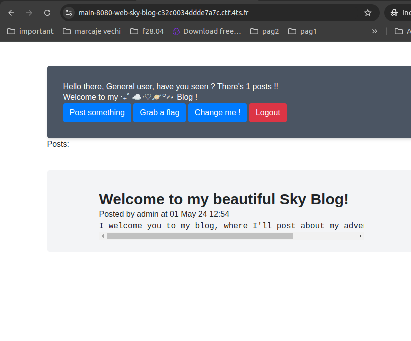
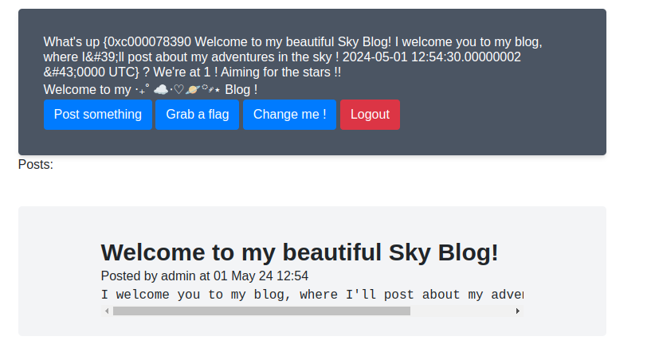
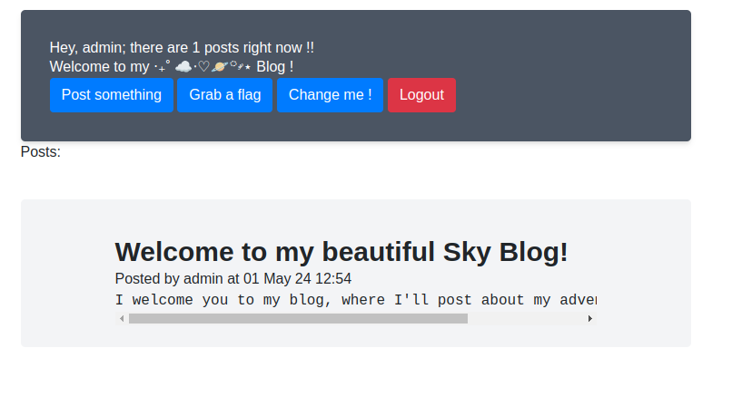
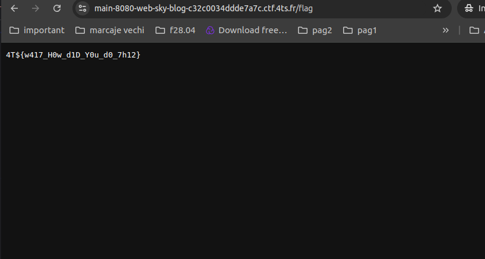

## Task

```
Welcome to my blog, I hope you find everything you need there.

It certainly is a bit empty, but I'm sure you'll find something interesting to post !
```

### Landing Page
After opening the instance I landed here


I explored the Blog Platform
by creating a new user and logging in


I observed that all user sessions were maintained 
in a shared environment, indicating potential 
vulnerabilities in session management. (`session.go` file)

Looking in the `index.go` file i saw :

```
var randomSentences = []string{
"Hey, %s; there are %d posts right now !",
...
chosenSentence := fmt.Sprintf(randomSentences[rand.Intn(len(randomSentences))], s.User.Username, s.NbPosts)
coolSentence := template.Must(indexTemplate.New("cool").Parse(chosenSentence))

var buf bytes.Buffer
	if err := coolSentence.Execute(&buf, s); err != nil {
		fmt.Println("Error executing template:", err)
		return indexTemplate.Execute(c.Response().Writer, s)
	}
```
Since `chosenSentence` is directly parsed into a template without escaping,
if the username or post count were user-controlled,
it might allow for template injection. If a malicious user would inject Go 
template code in the username or other fields used in chosenSentence, 
arbitrary commands might be executed.

While examining the `Change Me` page, I found that I could enter code directly into the user 
field and the executed in the `index` page
(`{{range .Posts}} {{.}} {{end}}`)


Through the post I can modify admin password
```go
type Post struct {
    Author *User
    Title  string
    Body   string
    
    UpdatedAt time.Time
}

type User struct {
	isAdmin  bool
	Username string
	Password string
}
```

With the injection capability established, I crafted a payload to alter 
the admin user's password by invoking the ChangePassword function on the Author
`{{range .Posts}} {{.Author.ChangePassword "lol"}} {{end}}`


Then I logged as admin with the password I set earlier


Got flag

